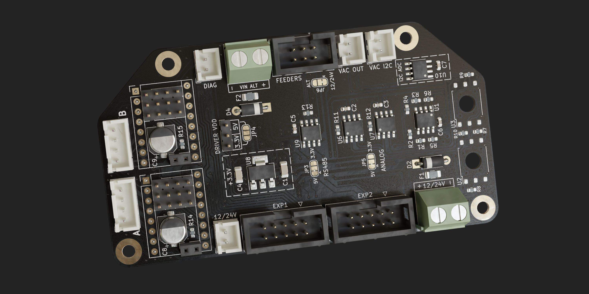

## LumenPnP Ramps Expander

**Warning: This design hasn't been ordered/tested yet. Use at your own risk.**

I created this board to use as an expander for the MKS Gen L v2.1 I use to as a motherboard for
my LumenPnP.

It offers:

- 2 additional stepper drivers
- RS485 driver for feeders
- analog REV03 style vacuum sensors (I2C ADC option)
- extra power input to power feeders from a different (12V) PSU

While this was originally designed for the MKS Gen L v2.1, it should generally be compatible
with all ATmega2560 based RAMPS boards and maybe even other 3d printer boards that have the
12864 display expansion connectors.
